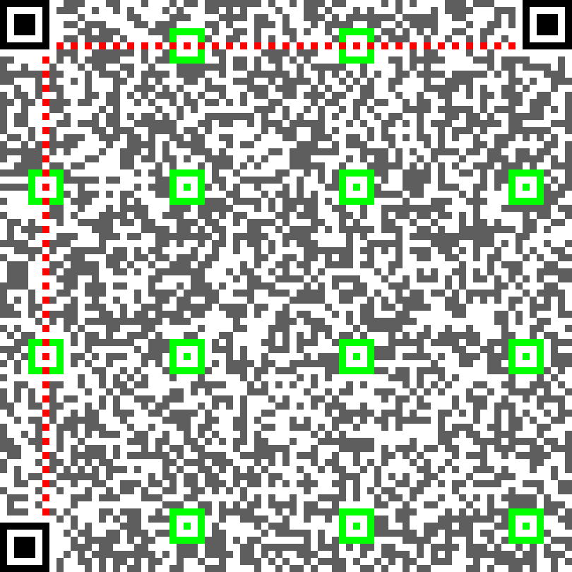
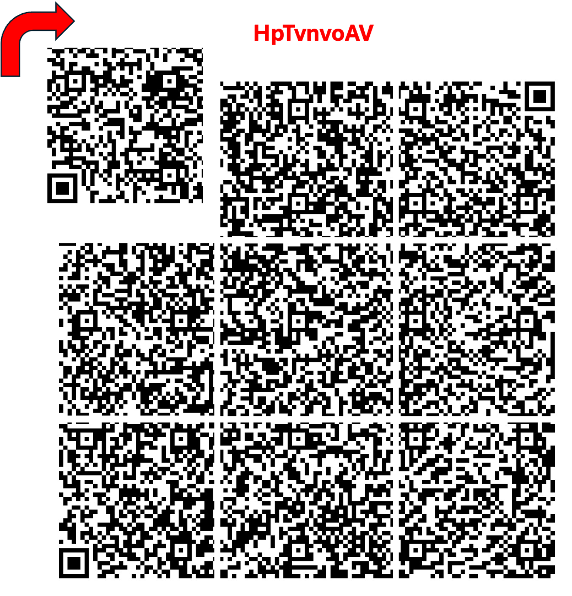
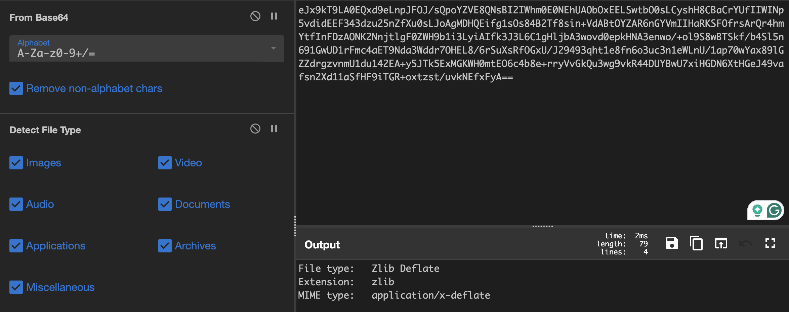
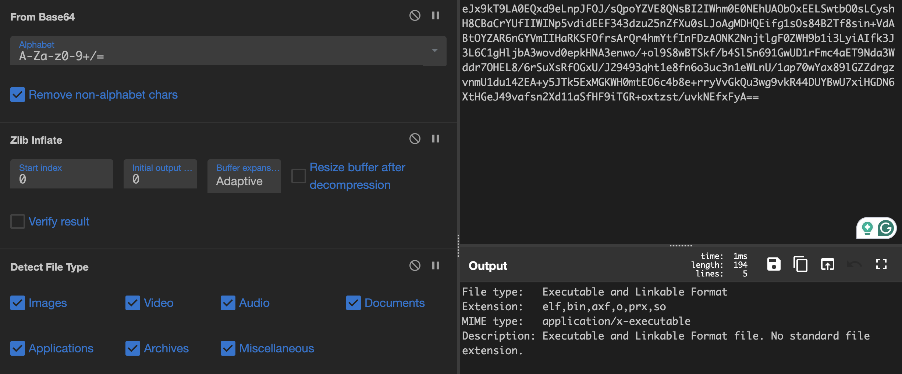
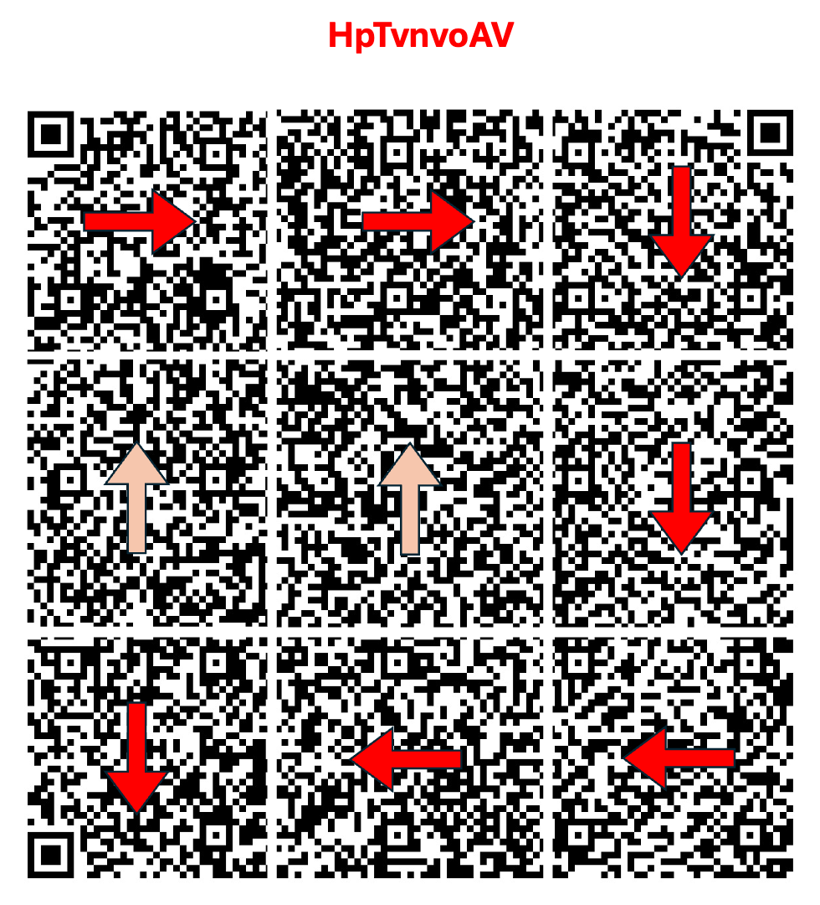
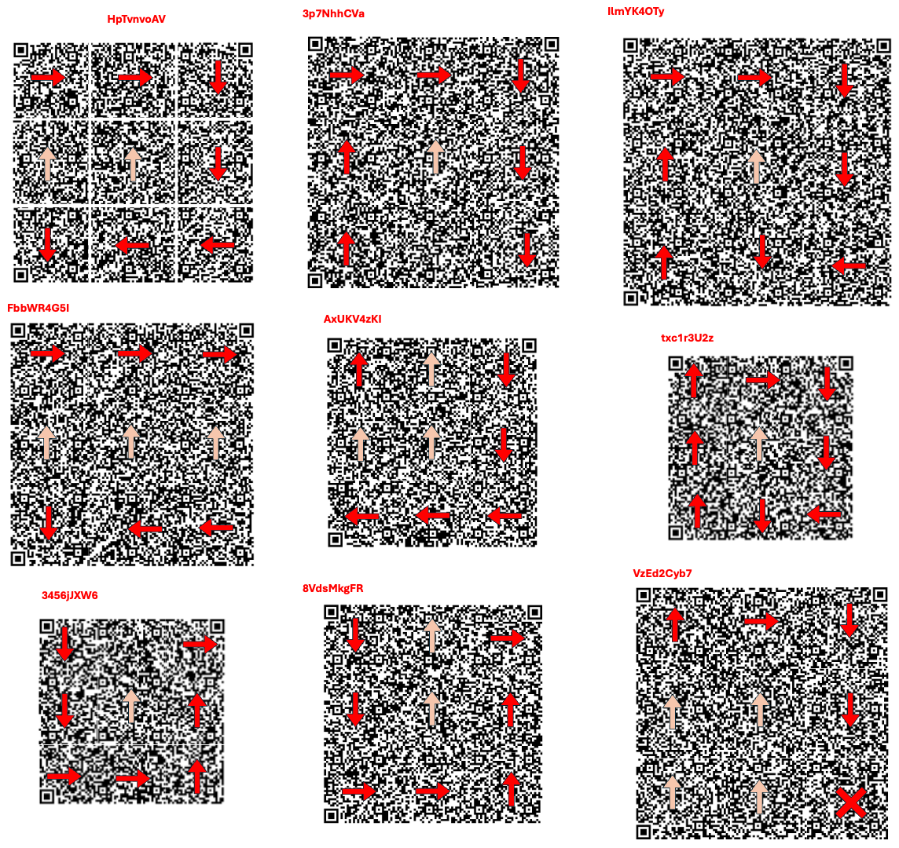
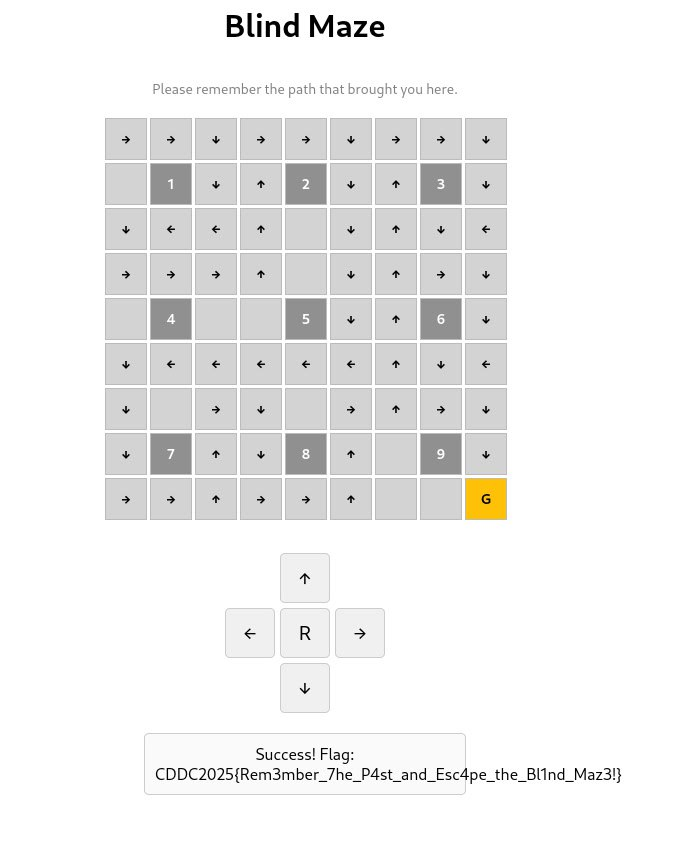
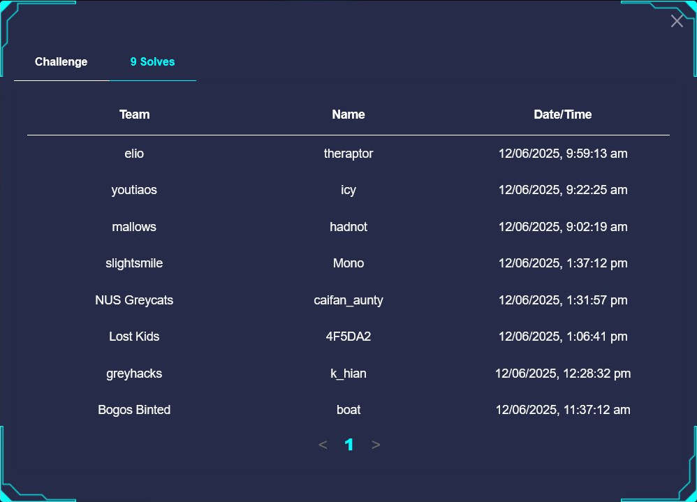

# [MISC] Shattered Maze

## Description

I am lost.
The path I've walked and the road ahead are hidden from sight.
Can these tangled QR codes become my gateway to escape?

Distrib: [shattered_maze.zip](https://raw.githubusercontent.com/k-hian/CTFWriteups/refs/heads/main/Brainhack%20CDDC%202025/Shattered%20Maze/distrib/shattered_maze.zip)

### Flag

`CDDC2025{Rem3mber_7he_P4st_and_Esc4pe_the_Bl1nd_Maz3!}`

## Approach

### QR Codes

The challenge consists of 9 folders, each containing 9 image fragments. Each folder holds pieces of one full QR code, giving us 9 complete QR codes to reconstruct. Our first goal: reassemble each QR code. But how?

QR codes have a certain structure. While a quick search can shed light on what data different sections encode, we shall focus more on the visual features crucial in reconstructing a QR code. Here's an example from one of the QR codes in the challenge:



Most people recognize the 3 positioning markers in the 3 corners, but not everyone is aware of the **timing patterns** (in <span style="color:red">red</span>) — the alternating black-and-white pixels that run horizontally (and vertically). For smaller QR codes, only the horizontal pattern is present, but for larger QR codes like these, both directions are used.

Additionally, **alignment markers** in <span style="color:lightgreen">green</span> are distributed in grid pattern throughout the code. The number and placement of these markers depend on the size of the QR code, and are spaced evenly on both horizontal and vertical axes.

Using this knowledge, we can first identify the 4 corner pieces. By using the timing pattern, we can know which of the 3 position markers must appear in which corner:
- top left has <span style="color:red">timing pattern</span> both direction
- top right has <span style="color:red">timing pattern</span> on the left (or counter-clockwise)
- bottom left has <span style="color:red">timing pattern</span> on the top (or clockwise)

Then, we place the 2 edge pieces with <span style="color:red">timing pattern</span>. While doing so, we can use the <span style="color:lightgreen">alignment markers</span> to ensure that the the placement of the edge pieces is correct.

After aligning the two edge pieces, we could extrapolate the placement of the remaining 2 edge pieces (similarly using the <span style="color:lightgreen">alignment markers</span>). Lastly, we can place the centre piece, rotating it as needed to ensure the <span style="color:lightgreen">alignment markers</span> are evenly spaced. (fyi, none of the centre pictures were rotated in this challenge)

### Reconstructing QR

Personally, I prefer to use powerpoint for this kind of work. While not sophisticated, it provides enough versatility, as well as helps retain information that might be useful (either through the undo feature or additional comments using textboxes)



While reconstructing the QR codes, we noticed that some of the images are not oriented in the right direction. This didn’t hinder the reconstruction but was worth noting — the orientation might encode something important. Using the above requirements, we assembled each QR code, and scanned them and extracted Base64-encoded payloads like the one below:
```text
eJx9kT9LA0EQxd9eLnpJFOJ/sQpoYZVE8QNsBI2IWhm0E0NEhUAObOxEELSwtbO0sLCyshH8CBaCrYUf
IIWINp5vdidEEF343dzu25nZfXu0sLJoAgMDHQEifg1sOs84B2Tf8sin+VdABtOYZAR6nGYVmIIHaRKS
FOfrsArQr4hmYtfInFDzAONK2NnjtlgF0ZWH9b1i3LyiAIfk3J3L6C1gHljbA3wovd0epkHNA3enwo/+
ol9S8wBTSkf/b4Sl5n691GwUD1rFmc4aET9Nda3Wddr7OHEL8/6rSuXsRfOGxU/J29493qht1e8fn6o3
uc3n1eWLnU/1ap70wYax89lGZZdrgzvnmU1du142EA+y5JTk5ExMGKWH0mtEO6c4b8e+rryVvGkQu3wg
9vkR44DUYBwU7xiHGDN6XtHGeJ49vafsn2Xd11aSfHF9iTGR+oxtzst/uvkNEfxFyA==
```

Playing around with cyberchef, we found that the decoded data is a Zlib deflate:



Inflating it via Zlib, we realized that one of the fragments was an ELF header:



### ELF file

Decoding and inflating the remaining QR outputs, we found ELF-related data across all fragments:
```
hlt.crtstuff.c.__CTOR_LIST__.__DTOR_LIST__.__JCR_LIST__.__do_global_dtors_aux
.completed.5339.dtor_idx.5341.frame_dummy.__CTOR_END__.__FRAME_END__.__JCR_END__
...
__gmon_start__.__dso_handle._IO_stdin_used
...
```
and section names:
```
symtab..strtab..shstrtab..interp..note.ABI-tag...
.comment..pdr..gnu.attributes..mdebug.abi32
```

From this, we deduced that we need to reconstruct the ELF file from the 9 data segments we obtained (from the QR codes) to gain more information. Being new to this (type of challenge), we went down the rabbit hole trying to read up more on the structures of the ELF file. Not a particularly fruitful (or rabbit-ful) rabbit hole unfortunately. 

Next we turned to brute force. Knowing the header must be first, we only needed to determine the correct order of the remaining 8 fragments. This gives us 8! (40,320) possible permutations. (Actually, the number of permutations can be reduced with domain knowledge — for example, two fragments contain a split `.shstrtab` section and must be adjacent)

We wrote a script to brute-force all permutations, concatenate the fragments, and validate the resulting binary using pwntools:

```python
from base64 import b64decode, b64encode
import zlib
from itertools import permutations
from pwn import *

header = ("HpTvnvoAV","eJx9kT9LA0EQxd9eLnpJFOJ...uvkNEfxFyA==")

others = [("8VdsMkgFR","eJxdUqtOxEAUPVO6UJKFtF0e...T5pBj53fNIK/D/c2T+w"),
          ("3p7NhhCVa","eJx1UT1Lw1AUvWlqfWrVqIMd...fF9iZ3fvfsBWad2GQ=="),
          ("3456jJXW6","eJxt0LsSwUAYhuHdJEgc43w2...o0vN7/c+uADIJgcYg=="),
          ("IlmYK4OTy","eJx1kr9v00AUx78+W3CpGC4/...Phl2G4aoxWJ5h/7VbQy"),
          ("txc1r3U2z","eJx10bEOwVAUBuC/irRh6Ggw...xul6V259W/fF5bpJgw="),
          ("VzEd2Cyb7","eJxdkLFu2zAQhg+FhxTI0GYo...oBc8wI2vjTlFWTC1Tw="),
          ("FbbWR4G5I","eJx9UE1LAlEUvabUCEG2qmCq...gxZJCIgRStXPwG775Kn"),
          ("AxUKV4zKI","eJyVkD1LxEAQht/kzlORAysR...bJMMHO8yfr7AwnWRgU=")]

# data shortened for brevity

perm = permutations(list(range(8)))

def decom(n):
    return zlib.decompress(b64decode(n)).hex()

FILE = "output_{}.bin"

c = 0

context.arch = 'mips64'
context.endian = 'little'
context.os = 'linux'

for p in perm:
    b = decom(header[1])
    for i in p:
        b += decom(others[i][1])

    with open(FILE.format(c), "wb") as f:
        f.write(bytes.fromhex(b))
    try:
        elf = ELF(FILE.format(c))
        print(f"[+] Valid ELF detected: Architecture = {elf.arch}, Entry = {hex(elf.entry)}")
        print(f"    {c} - {list(others[i][0] for i in p)}")
    except Exception as e:
        # print(f"[-] Not a valid ELF: {e}")
        os.remove(FILE.format(c))
    c += 1
```

Eventually, we found the permutation that yielded a valid ELF file:
```
[*] '/output_7070.bin'
    Arch:       mips-32-big
    RELRO:      No RELRO
    Stack:      No canary found
    NX:         NX disabled
    PIE:        No PIE (0x400000)
    RWX:        Has RWX segments
    Stripped:   No
[+] Valid ELF detected: Architecture = mips, Entry = 0x400510
    7070 - ['3p7NhhCVa', 'IlmYK4OTy', 'FbbWR4G5I', 'AxUKV4zKI', 'txc1r3U2z', '3456jJXW6', '8VdsMkgFR', 'VzEd2Cyb7']
```
> [!NOTE]
> Another permutation may appear valid to pwntools, but doesn’t produce a truly valid ELF.

Decompiling the reconstructed binary using Ghidra revealed a single relevant function:

```
undefined4 main(void)

{
  size_t sVar1;
  uint local_418;
  byte abStack_414 [1032];
  
  for (local_418 = 0; sVar1 = strlen(flag), local_418 < sVar1; local_418 = local_418 + 1) {
    abStack_414[local_418] = flag[local_418] ^ 6;
  }
  abStack_414[local_418] = 0;
  return 0;
}
```

The flag string is:
```
"nrrv<))djohb+kg|c(n2e(mt<5667)"
```

After XOR-ing each character of the `flag` string with `0x6`, we revealed the URL `http://blind-maze.h4c.kr:3001` — the endpoint used to verify correct maze paths, which doesn't seem very helpful here. This endpoint can be obtained by intercepting requests from the original website.

But at least from this, we know that the ELF is reconstructed correctly.

### The Path

In the source code of the website (to submit the path to), there was a hint included:

```javascript
hint = ['e', 'e', 's', 's', 'w', 'w', 's']
// translates to: right, right, down, down, left, left, down
```

Let's take a closer look at the QR code that correspond to the header data segment ("HpTvnvoAV"). Inspired by the hint on the submission website, we considered these rotations as directional steps in a maze.



Starting from the top left image, the path matches exactly the path laid out by the hint!

If we arrange the remaining QR codes from left to right, top to bottom, based on the order that formed a valid ELF file, we get the following:



Following the directional logic through all QR codes:



**The flag is** `CDDC2025{Rem3mber_7he_P4st_and_Esc4pe_the_Bl1nd_Maz3!}`

## Thoughts

Definitely an interesting MISC challenge, utilising QR codes very nicely. CDDC was help over 2 days, and unfortunately, I didn't examine the source code on the first day so I didn't find the hint. I think that I might have been able to first blood at the start of the second day, but this "mistake" cost me. Learn from my mistakes I guess.

I did manage to be the 5th blood, and last I checked (before scoreboard close 1h before end), there were only 9 solves in total.

