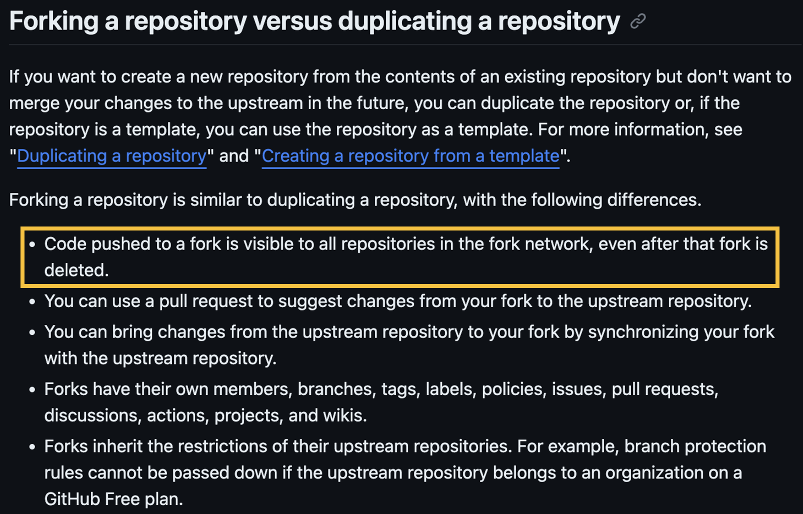
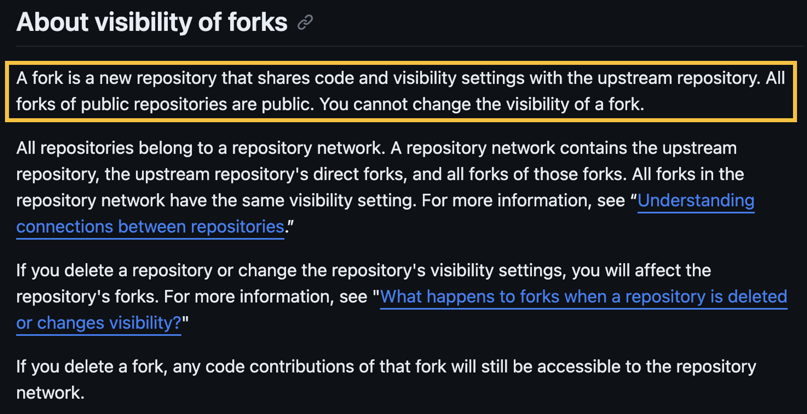
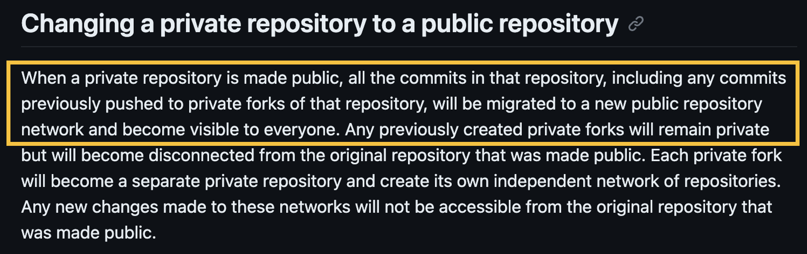
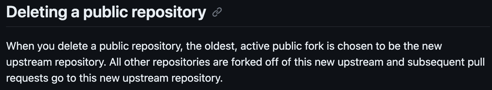

# [OSINT] Red Flag Recon

## Description

Since announcing GreyCTF, we've noticed persistent comments on the GreyHats Instagram account from a user keen to create a challenge for us. But with GreyCTF so close to our final exams, we haven't had the bandwidth to properly vet him. Help us check him out, make sure there are no red flags.

Note: There is only one flag in this challenge. If it fits the flag format `grey{...}`, you've likely got it!

## Solution

1. Identify the person asking to make challenges on the greyhats' instagram account. (Insta Username: `ducati777__`)
2. Find associated social media accounts. (X Username: `ducati777_`)
3. The challenge ask to find "red flags": `Im writing a new challenge 🚩.` (the post mentioned storing flags on a private fork)
4. Find the github account, similar name + same profile pic. (Github Username: `ducati777-o`)
5. Navigate to the relevant repo. (User/Repo: `Brainstorm-Nonsense/chal-collection`)
6. (Use the TruffleHog tool to) Bruteforce find hidden commit hashes.
7. View the [commit](https://github.com/Brainstorm-Nonsense/chal-collection/commit/385a712af8aad142f363cd2130d419ad09f68214) with hash = `385a712af8aad142f363cd2130d419ad09f68214` from step 6 (you only need to identify the first 4 chars of the hash)
8. Get the flag. (`grey{R4nD_n0_c4n7_h1d3_f14G}`)
 
> It is possible to solve this without finding the TruffleHog tool. A player managed to bruteforce using multiple threads, although you will likely be rate limited after a while.

## Tools used - TruffleHog by Truffle Security Co.
(Read here: https://trufflesecurity.com/blog/trufflehog-now-finds-all-deleted-and-private-commits-on-github)

```
>>> trufflehog github-experimental --repo https://github.com/Brainstorm-Nonsense/chal-collection.git --object-discovery --token gph_1234githubtoken

>>> cat ~/.trufflehog/Brainstorm-Nonsense/chal-collection/valid_hidden.txt
...
385a712af8aad142f363cd2130d419ad09f68214    <- flag is at this commit
...
```


## Challenge Setup

1. Created an organization, let's say I created an organization called `OSINTrial`.
   - Ensure the organization's setting *allows forking of private repos*.
   - _I think it is not strictly necessary to create an organization, but I did for this challenge_
2. Create a **private** repo in this organization, let's call it `upstream_project`.
   - We will make this repo public on step 6. This is to simulate open-sourcing a project.
3. Fork this private repo, let's call it `internal_fork`
   - The repo can belong to any organization or any user. It doesn't seem to affect the setup.
4. Make some secret commits on `internal_fork` that you don't want made public (in theory).
5. Change the visibility of `upstream_project` from private to public.
   - Simulate open-sourcing a project.
6. Suppose a bad actor obtained the SHA-1 hash of the commit
7. They can view the "private" commit through the public repo using the SHA-1 hash.
   - Eg. https://github.com/OSINTrial/upstream_project/commit/385a...


## Slightly technical explanation (github policy)

> _First and foremost, I would like to credit the original team, Truffle Security Co., for their excellent work in documenting the "issue" and spreading the word. I merely did a rehash of their explaination with slightly more reference to github's official policies/documentation, so I strongly recommend checking them out! (Read here: https://trufflesecurity.com/blog/anyone-can-access-deleted-and-private-repo-data-github)_

Looking at GitHub's documentation, you will realise that it is in fact intended for any commits made on a repository to be visible by the entire fork network. 



Source: [GitHub Doc: About forks](https://docs.github.com/en/pull-requests/collaborating-with-pull-requests/working-with-forks/about-forks#forking-a-repository-versus-duplicating-a-repository)

How are "fork networks" defined? Simply, all forks of a repo (and any subsequent forks) are interconnected within this network, with a catch: **All forks in a fork network should have the same visibility**, as visibility is inherited from the parent, and cannot be changed (in the fork). Therefore, even if commits are visible by the whole network, the network is either all public or all private so it doesn't pose as big a security issue. (if someone has unauthorised access to your private fork network, i think you have bigger concerns)



Source: [GitHub Doc: About permissions and visibility of forks](https://docs.github.com/en/pull-requests/collaborating-with-pull-requests/working-with-forks/about-permissions-and-visibility-of-forks#about-visibility-of-forks)

While on its own this feature is quite harmless, it poses a security issue when organizations incorrectly open source their projects while having private internal repos. In particular, if the open-sourcing is done after having committed some sensitive information to another private repo in the fork network.



Source: [GitHub Doc: What happens to forks when a repository is deleted or changes visibility?](https://docs.github.com/en/pull-requests/collaborating-with-pull-requests/working-with-forks/what-happens-to-forks-when-a-repository-is-deleted-or-changes-visibility#changing-a-private-repository-to-a-public-repository)

Thankfully, once the repo is made public, it severs all connection to the private fork network, so any sensitive commits made after the visibility change is safe. However, any prior commits are fair game.

Furthermore, these "exposed" sensitive commits could be perpetually exposed if a new fork was made before the mistake was realised. Suppose you are the manager, and this was brought to your attention. Your first thought is probably to delete the public repo, afterall you still have your internal private repo as backup.

Unfortunately for you, even if you delete the public repo, the oldest active public fork will take over as the new upstream repo, allowing anyone to access your sensitive commits through this new upstream repo. In short, if someone made fork before you delete the repo, you are f*cked.



Source: [GitHub Doc: What happens to forks when a repository is deleted or changes visibility?](https://docs.github.com/en/pull-requests/collaborating-with-pull-requests/working-with-forks/what-happens-to-forks-when-a-repository-is-deleted-or-changes-visibility#deleting-a-public-repository)
