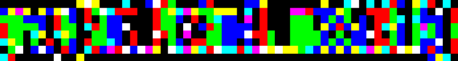
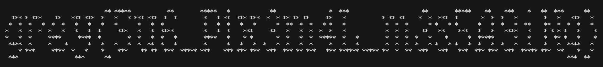

# [MISC] subGB

## Description

My friend sent me this image. What the ***k am I suppose to do with it?!??

Hint: `Gotta paint those RGBs onto a grid.`



Distrib: [subGB.png](https://raw.githubusercontent.com/k-hian/CTFWriteups/refs/heads/main/Grey%20Cat%20The%20Flag%202025/subGB/distrib/subGB.png)

### Flag

`grey{Su6_P1x3m4L_m3s5A9iNg}`

## Solution

This challenge is a Steg challenge masqurading as a Misc... although technically still a misc. This is probably the guessiest among the misc challenges (or among all the categories), so the hint was provided: `Gotta paint those RGBs onto a grid.` Admittedly, not a great hint lol.

This challenge is based on the idea of [Subpixel Text Encoding](https://www.msarnoff.org/millitext/), where you need to split each pixel into their respective RGB values, and lay them out in order to read the message.

### Script

```python
from PIL import Image
import numpy as np
import itertools

img = Image.open("distrib/subGB.png")
npar = np.asarray(img)
pix = npar.tolist()

for row in range(len(pix)):
    # remove alpha values from data
    pix[row] = list(itertools.accumulate(pix[row],lambda x,y: (x[:3] if len(x)==4 else x)+y[:3]))[-1]

for row in pix:
    for col  in row:
        if col == 255: print("*",end="")
        else: print(" ",end="")
    print()
```

Using PIL, we can extract the individual RGB(A) values from the image. After dropping the A values, we can print the outputs row by row. In this case, I simply printed `*` if `value == 255` (max value / on), and ` ` (space) otherwise, to get:

```
                              ** *****           **        *****   *            **                *  ***                      **        *****    **    ***    *   **  ***      **   
  *** * ***    **   *** ***  *   *   * *** ***  *  *        *   * **  *** ***  *  * ** ** **     **   *           * ** **    *  *  ***  *       *  *  *   *        *   *   ***   *  
 *  *  *   *  *  *   *   *   *   *      *   *  *            *   *  *   *   *      *  **  *  *   * *   *            *  *  *      * *   * *      *   *  *   *  **    **  *  *  *   *  
*   *  *  *  *   *   *   *  *     ***   *   *  ****         *   *  *    ***     **   *   *  *  *  *   *            *  *  *    **   **    ***   *   *   ****   *    * * * *   *    * 
*   *  *     ****     ****  *        *  *   *  *   *        ****   *    * *       *  *   *  *  *****  *   *        *  *  *  *   *    *      *  *****      *   *    *  ** *   *    * 
 ****  *     *    *      *   *   *   *  *  **  *   *        *      *   *   *  *   *  *   *  *     *   *   *        *  *  *  *   * *   * *   *  *   *  *   *   *    *   *  ****   *  
    * ***     ****  *   *    *    ***    ** **  ***  ***** ***    *** *** ***  ***  *** ** ***   *** ****** ***** **  *  **  ***   ***   ***  *** ***  ***  ***** ***  **    *   *  
 ***                 ***      **                                                                                                                                          ***  **    
```



The 'pixel art' reads `grey{Su6_P1x3m4L_m3s5A9iNg}` which is the flag, although some people mistake the `S` and `5`.

## Thoughts

Not the best challenge. While the idea of subpixel text encoding it good, I don't think I executed it well ~~enough~~ at all.