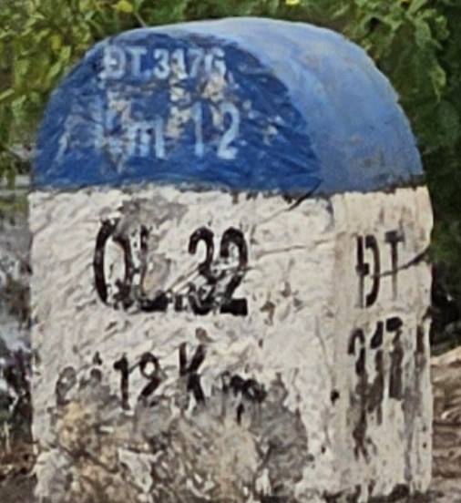
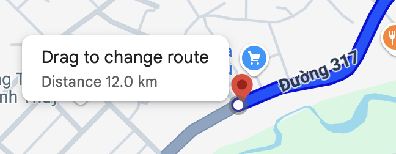
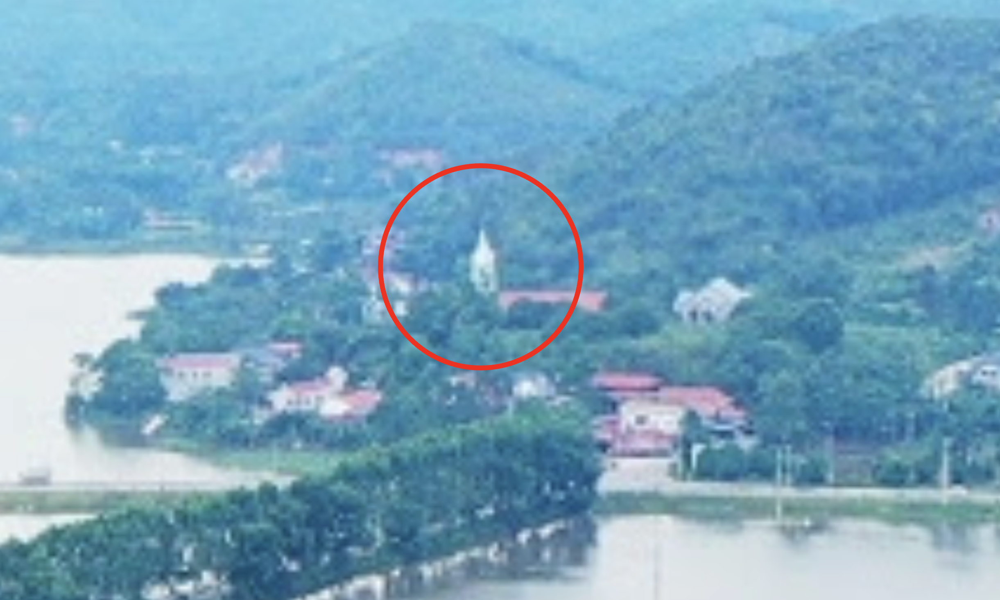
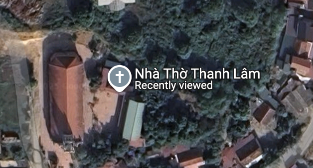
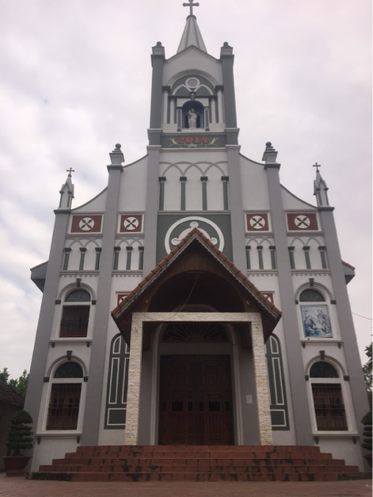
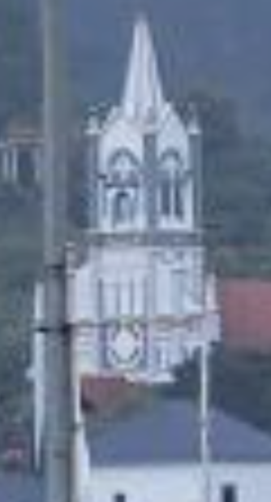
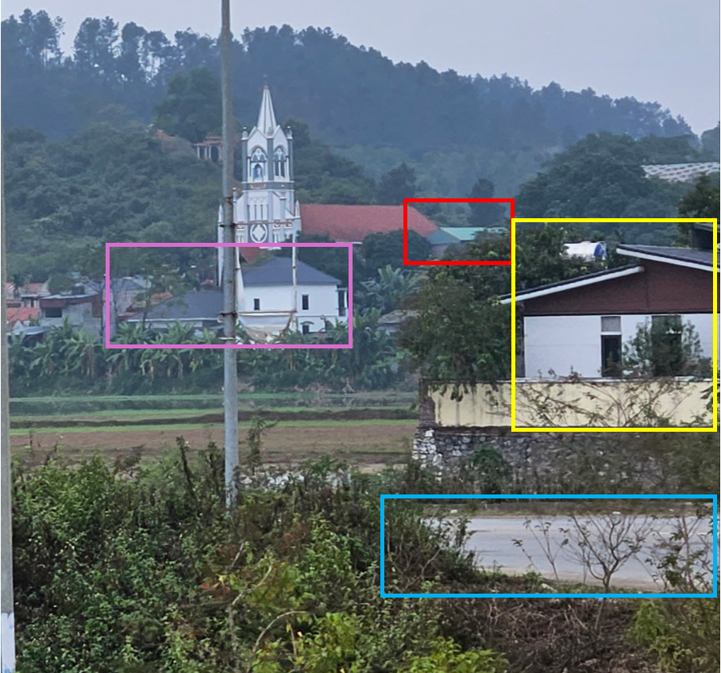
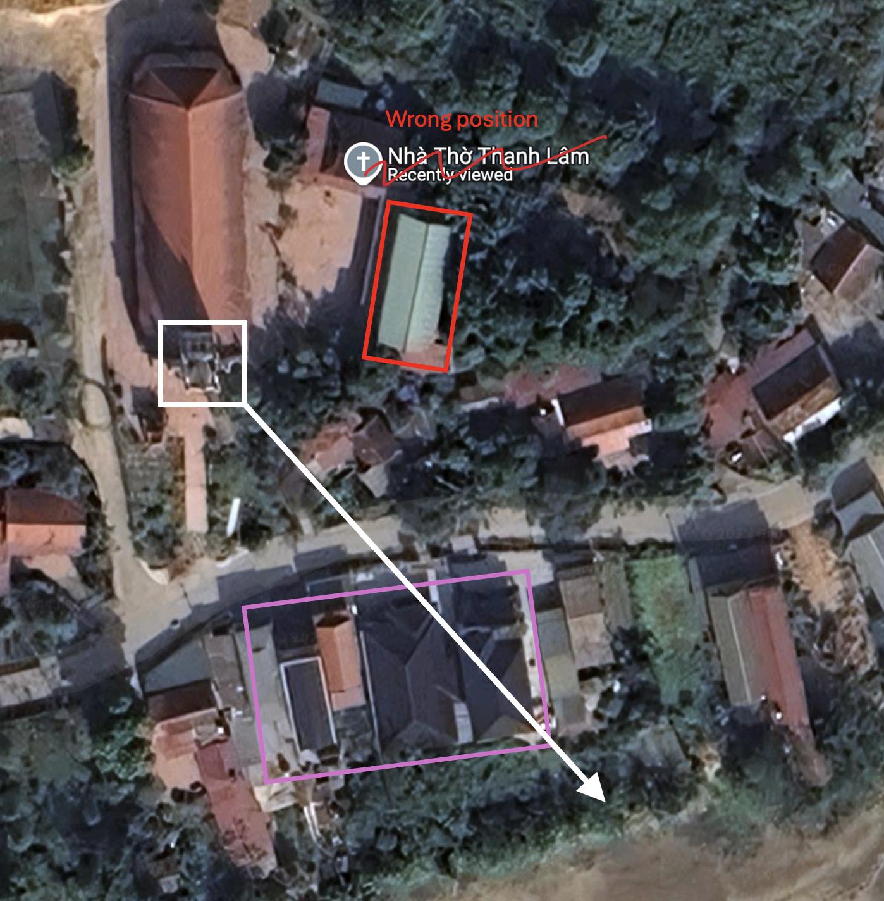
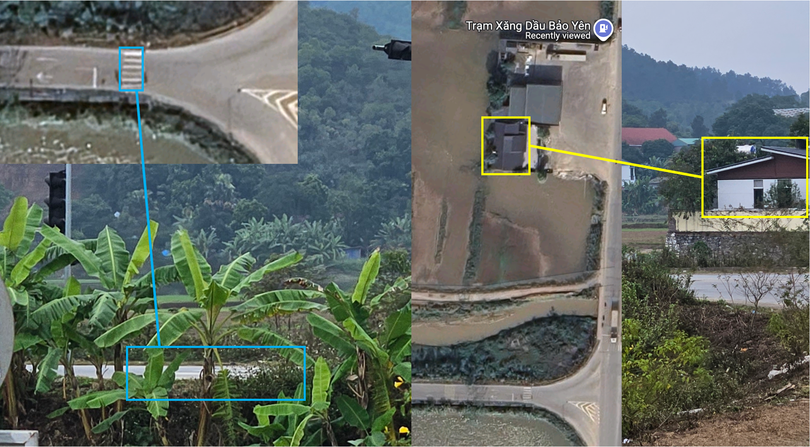

# By The Banana Tree

## Description

I saw a church in the distance while travelling. Can you tell me where it is?

The flag consists of latitude and longitude coordinates of the location where the photo was taken, rounded to three decimal places, and the name of the church in the distance in lowercase (according to google maps, omitting any potential spaces, punctuation and diacritics).

Regarding flag format, consider this example for Notre Dame de Paris: `grey{N48-853_E2-349_notredamecathedralofparis}`

Distrib: [bythebananatree.png](https://raw.githubusercontent.com/k-hian/CTFWriteups/refs/heads/main/Grey%20Cat%20The%20Flag%202025/By%20The%20Banana%20Tree/distrib/bythebananatree.png)

### Flag

grey{N21-153_E105-274_nhathothanhlam}

## Concept

This challenge uses osint research to interpret mile markers (assuming no prior knowledge), and geolocation skills like working with online map (particularly in the absense of comprehensive street view).

Or you can just use ChatGPT. 🥹

## Solution

Doing a preliminary reverse image search on google, one can identity the country: Vietnam

One can notice the mile marker in the foreground. The text on the marker is roughly readable.
- Blue top: ĐT 317   Km (?) 12
- Main face: QL.32   12 Km
- Side face: ĐT 317

Doing some research, one can find out that both QL32 and ĐT317 are valid road identifiers, but which is the relevant one? Provincial roads (tỉnh lộ or đường tỉnh, TL or ĐT) have white milestones with blue or green tops [1], so the current road must be 'more closely related' to ĐT317.

Looking up google maps, ĐT317 is lacking street view, except a short stretch closer to the city, so one should try to narrow the search area a bit more.

Mile markers (or more accurately Kilometer posts, cột kilômét) is placed on the right-hand side in the direction from the starting point (road origin) to the end point of the road, at an even distance of 1,000m [2].

Inferring that QL32 is the road origin, one can identify the rough location that the photo was taken by measuring the distance starting from where QL32 and ĐT317 intersect.

From the image, the photo seems to be taken beside a pond or a flooded paddy field, and is much closer to hills/mountains. It seems like the above location is not quite right, but using a nearby (aerial) photo sphere, we can see some paddy fields and mountains in the distance.

Using a photo sphere closer to those paddy fields and mountains, one can notice a white church-like structure by zooming in.

One can confirm that there is indeed a church at that location.

Comparing the images of the church with the provided photo, one can see the similarities, confirming that this church is the one captured in the photo (Name of church: Nhà Thờ Thanh Lâm).

Zooming into the provided photo, one can see that two buildings with black and green roof (respectively) are standing between the POV and the church (in purple & red boxes). A house (in yellow box) can also be seen much closer to the POV, across what seems to be a road (in blue box).

The black roof (in purple box) is almost colinear with the church (in white box) and POV, while the green roof (in red box) is off to the right. From this, one can determine the POV's direction relative to the church's location.

Though not very obvious, one might see the zebra crossing just behind the banana trees, which matches up with the zebra crossing at the first junction we encounter using the relative direction above. The roof of the house in the foreground also seems to match the roof on the map.

Using the coordinates to the junction, and the name of the church, the flag is therefore `grey{N21-153_E105-274_nhathothanhlam}`.

## Thoughts

This challenge was the longest in-the-making. The photo was taken back in December 2024.

As I was helping out with the support for the qualifiers, I noticed a lot of people finding the picture of the correct church, but getting the name and location of the church wrong. 

The correct church was `Nhà Thờ Thanh Lâm`, but for some reason (most likely human error), a single image of the church was uploaded to a nearby `Nhà thờ Phù Lao`. From the solution steps above, you might have realised I did not really go indepth into reverse image searching the provided photo, so I did not find the "misplaced" image.

I think that this was a good OSINT challenge nonetheless. Assuming players didn't rely on ChatGPT too much, the solution was pretty standard, and at a difficulty level I am happy about. The additional "red herring" also helped teach the idea that `not all information can be trusted`, which was a point I kept bringing up in the support tickets.

Definitely looking forward to travelling again and finding OSINT gems like this.

## References

[1] [Driving in Vietnam](https://en.wikivoyage.org/wiki/Driving_in_Vietnam)  
[2] [National Technical Regulation on Traffic Signs and Signals of Vietnam](https://upload.wikimedia.org/wikipedia/commons/8/81/2019_standardisation_of_National_Technical_Regulation_on_Traffic_Signs_and_Signals_of_Vietnam.pdf)
